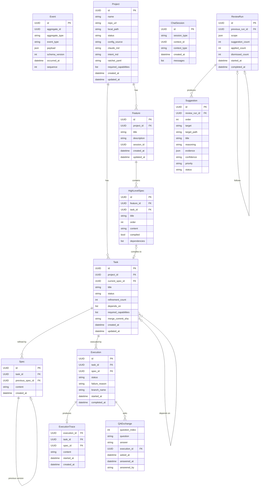

# Data Model

All state is derived from event replay. The `events` table is the single source of truth. Pydantic models below represent the projected state at any point in time.

## Entity Relationship Diagram

## Event Sourcing

All entities above are projections derived by replaying events from the `events` table. Each entity has a corresponding manager class that replays events to build the current state:

| Entity | Manager | Aggregate Type |
|--------|---------|---------------|
| Project | `ProjectManager` | `project` |
| Task | `TaskManager` | `task` |
| Spec | `SpecManager` | `spec`, `task_spec` |
| Execution | `ExecutionManager` | `execution`, `task_executions` |
| Feature | `FeatureManager` | `feature`, `project_features` |
| HighLevelSpec | `FeatureManager` | `feature` |
| ChatSession | `ChatSessionManager` | `chat_session` |
| ReviewRun | `ReviewManager` | `review` |

## Materialized Views

PostgreSQL materialized views provide fast reads for the web UI:

| View | Source | Refreshed |
|------|--------|-----------|
| `current_tasks` | task events | On event append + periodic |
| `current_projects` | project events | On event append + periodic |
| `current_specs` | spec events | On event append + periodic |
| `current_executions` | execution events | On event append + periodic |
| `current_features` | feature events | On event append + periodic |
| `current_high_level_specs` | feature events | On event append + periodic |
| `current_chat_sessions` | chat_session events | On event append + periodic |

Web API handlers read from views via `web/queries.py`. Worker/dispatch logic reads from event replay via `core/` managers.
