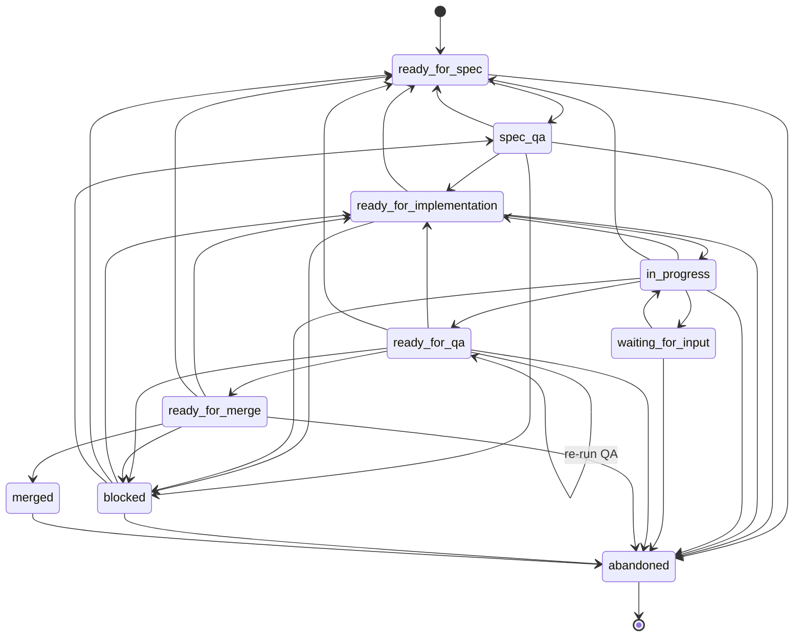

# Task State Machine

## States

| State | Description |
|-------|-------------|
| `ready_for_spec` | Task created, awaiting spec assignment |
| `spec_qa` | Spec assigned, under review |
| `ready_for_implementation` | Spec approved, awaiting worker dispatch |
| `in_progress` | Worker executing the task |
| `waiting_for_input` | Claude asked a question, awaiting human answer |
| `blocked` | Execution failed, requires intervention |
| `ready_for_qa` | Implementation complete, awaiting QA pipeline |
| `ready_for_merge` | QA passed, awaiting merge |
| `merged` | Merged to target branch, deployed |
| `abandoned` | Terminal state, task cancelled |

## Transitions



## Happy Path

The primary flow is:

```
ready_for_spec → spec_qa → ready_for_implementation → in_progress → ready_for_qa → ready_for_merge → merged
```

## Recovery Paths

- **blocked → ready_for_implementation**: Unblock a failed task for retry with same spec
- **blocked → ready_for_spec**: Re-spec a failed task from scratch
- **blocked → spec_qa**: Revise the spec
- **in_progress → ready_for_implementation**: Orchestrator restart recovery (orphaned task)
- **in_progress → waiting_for_input → in_progress**: Claude asks a question, human answers, execution resumes
- **ready_for_qa → ready_for_qa**: QA auto-fix attempt (same status, incremented fix counter)
